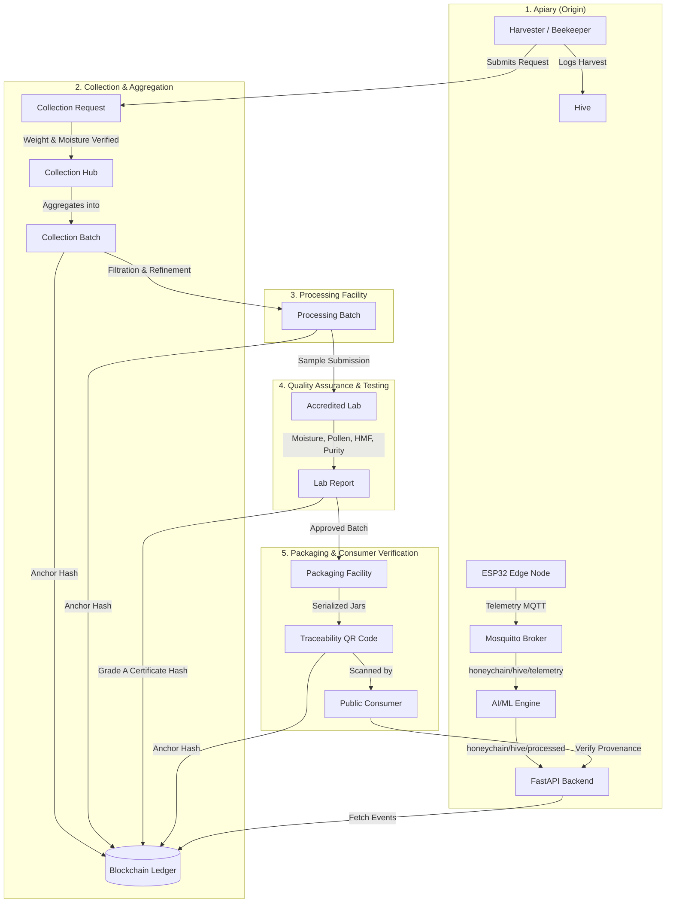
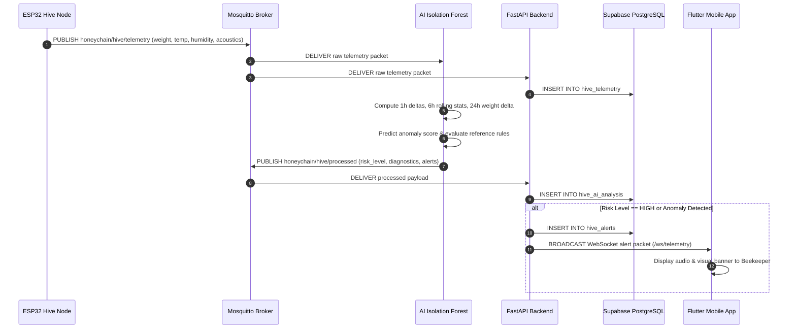

# HoneyChain — System Documentation & Architectural Blueprints

The `docs` module houses the comprehensive system architecture documentation, design specifications, workflow sequence diagrams, and cross-subsystem integration blueprints for the HoneyChain platform.

---

## 1. Documentation Index

| Document / Topic | Description | Target Audience |
| :--- | :--- | :--- |
| **System Overview & Architecture** | High-level topology connecting IoT, AI, Backend, Blockchain, and Mobile clients | All Developers / Architects |
| **End-to-End Honey Lifecycle** | Step-by-step state machine from apiary harvest to retail jar purchase | Product Managers / Domain Experts |
| **IoT Sensor Specifications** | ESP32 pinouts, sampling frequencies, and MQTT data schemas | Embedded / Firmware Engineers |
| **AI/ML Subsystem Architecture** | Isolation Forest baseline, rolling window feature engineering, and risk engine rules | AI / Data Science Engineers |
| **Backend REST & WebSocket APIs** | FastAPI endpoint contracts, SQLAlchemy database models, and real-time alerts | Backend / Integration Engineers |
| **Smart Contract & Provenance** | `HoneyChainProvenance.sol` data structures, event logging, and cryptographic verification | Web3 / Blockchain Engineers |
| **Mobile App Dashboards** | Role-based navigation for Harvesters, Collectors, Labs, Packaging, and Public Consumers | Mobile / UI/UX Engineers |

---

## 2. End-to-End Supply Chain Flowchart

---

## 3. Telemetry Stream Sequence Diagram

---

## 4. Documentation Standards

* **Format:** GitHub Flavored Markdown (`GFM`)
* **Diagrams:** Mermaid.js fenced code blocks (`mermaid`)
* **Mathematical Notation:** KaTeX / LaTeX format (`$math$`)
* **Integrity Guarantee:** Never edit, format, or modify files inside `ai_ml/`. It is strictly read-only.
